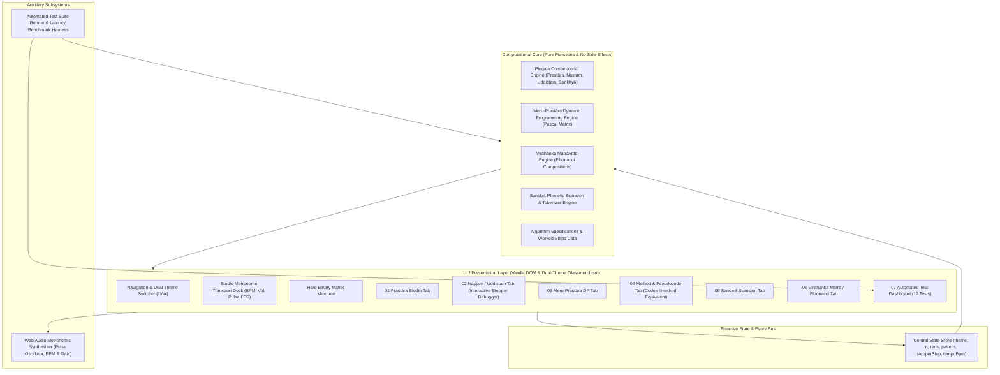

# Software Architecture & Mathematical Specification

## Project: Piṅgala's Chandaḥśāstra as Binary Encoding & Combinatorial Generation
**Document**: `ARCHITECTURE.md`  
**System Type**: Pure Client-Side High-Performance Web Application  
**Execution Runtime**: Modern Web Browser (ECMAScript 2022+ / Web Audio API)

---

## 1. System Architecture Overview

The system architecture follows a clean, decoupled **Layered Pipeline Architecture** ensuring complete separation between the pure mathematical/algorithmic core, the Sanskrit phonological NLP scansion engine, the real-time Web Audio synthesizer, the automated test harness, and the reactive DOM rendering layer.



---

## 2. Mathematical Formalization & Core Algorithms

### 2.1 Binary Mapping Formalism
Let the metric alphabet be $\Sigma = \{\text{L}, \text{G}\}$, where:
- $\text{L} \equiv 0$ (Laghu, light syllable, duration $= 1\text{ mātrā}$)
- $\text{G} \equiv 1$ (Guru, heavy syllable, duration $= 2\text{ mātrās}$)

For a poetic meter of fixed length $n$ syllables, the universe of all possible metrical patterns is the binary hypercube:
$$\mathcal{V}_n = \{ \mathbf{b} = (b_1, b_2, \dots, b_n) \mid b_i \in \{0, 1\} \}, \quad |\mathcal{V}_n| = 2^n$$

---

### 2.2 Algorithm 1: Combinatorial Prastāra Generation
Generates all $2^n$ permutations in the canonical order established by Piṅgala (where column $i$ alternates every $2^{i-1}$ positions, starting with Laghu).

#### Formal Pseudocode:
```text
Algorithm PingalaPrastara(n: Integer) -> List of Patterns
Input: Syllable count n >= 1
Output: List P of 2^n patterns, each of length n

1. total <- 2^n
2. P <- empty list
3. For r from 1 to total:
4.     pattern <- PingalaNastam(r, n)
5.     Append pattern to P
6. Return P
```

*Complexity*: Time $O(n \cdot 2^n)$, Space $O(n \cdot 2^n)$.

---

### 2.3 Algorithm 2: Naṣṭam (Rank to Binary Pattern Decoder)
Given the ordinal index $R \in [1, 2^n]$, reconstruct the exact syllable pattern $(b_1, b_2, \dots, b_n)$ using Piṅgala's halving rule (*dvir ardhe*).

#### Piṅgala's Sūtras:
> *"Lagheveti samānam"* (When even, place Guru and divide by 2)  
> *"Viṣame rūpaṁ prakṣipya"* (When odd, place Laghu, add 1, and divide by 2)

#### Formal Pseudocode:
```text
Algorithm PingalaNastam(R: Integer, n: Integer) -> Array of Bit/Syllable
Input: Ordinal Rank R in [1, 2^n], Syllable length n >= 1
Output: Array B = [b_1, b_2, ..., b_n] where b_i in {'L', 'G'}
State: current_R <- R, trace <- empty list

1. B <- empty array of length n
2. For i from 1 to n:
3.     If current_R is odd:
4.         B[i] <- 'L' (Laghu = 0)
5.         current_R <- (current_R + 1) / 2
6.     Else:
7.         B[i] <- 'G' (Guru = 1)
8.         current_R <- current_R / 2
9. Return (B, trace)
```

*Complexity*: Time $O(n)$, Space $O(n)$ with zero external memory.

---

### 2.4 Algorithm 3: Uddiṣṭam (Binary Pattern to Rank Encoder)
Given a syllable pattern $B = [b_1, b_2, \dots, b_n]$ where $b_i \in \{0, 1\}$, determine its exact ordinal rank $R \in [1, 2^n]$.

#### Mathematical Basis:
The rank corresponds to the 1-based decimal valuation under little-endian binary positional weighting:
$$R(B) = 1 + \sum_{i=1}^n b_i \cdot 2^{i-1}$$

#### Formal Pseudocode:
```text
Algorithm PingalaUddistam(B: Array of Syllables) -> Integer
Input: Syllable array B = [b_1, b_2, ..., b_n] where b_i in {'L', 'G'}
Output: Ordinal rank R >= 1

1. R <- 1
2. place_value <- 1
3. For i from 1 to length(B):
4.     If B[i] == 'G':
5.         R <- R + place_value
6.     place_value <- place_value * 2
7. Return R
```

*Complexity*: Time $O(n)$, Space $O(1)$.

---

### 2.5 Mathematical Invariant Proof: Bijective Round-Trip
**Theorem**: For any $n \ge 1$ and any rank $R \in [1, 2^n]$,
$$\text{Uddiṣṭam}(\text{Naṣṭam}(R, n)) \equiv R$$
**Proof**:
At step $i$, Piṅgala's Naṣṭam assigns $b_i = 1$ (Guru) if and only if the current quotient is even, which corresponds exactly to the bit test $(R - 1) \ \& \ (1 \ll (i - 1)) \neq 0$.  
Since this mapping directly extracts the $i$-th bit of the integer $(R - 1)$, the reconstruction by Uddiṣṭam computes:
$$\text{Rank} = 1 + \sum_{i=1}^n \text{bit}_i(R - 1) \cdot 2^{i-1} = 1 + (R - 1) = R. \quad \blacksquare$$

---

### 2.6 Algorithm 4: Saṅkhyā (Fast Logarithmic Exponentiation)
Computes $2^n$ in $O(\log n)$ operations using Piṅgala's recursive halving aphorisms (*dvir ardhe*, *rūpe śūnyam*).

#### Formal Pseudocode:
```text
Algorithm PingalaSankhya(n: Integer) -> Integer
Input: Syllable length n >= 0
Output: Total combinations 2^n

1. If n == 0: Return 1
2. If n is even:
3.     half <- PingalaSankhya(n / 2)
4.     Return half * half
5. Else:
6.     Return 2 * PingalaSankhya(n - 1)
```

*Complexity*: Time $O(\log n)$, Space $O(\log n)$ call stack (or $O(1)$ iterative).

---

### 2.7 Algorithm 5: Meru-Prastāra (Dynamic Programming Binomial Triangle)
Constructs the combinatorial pyramid where each cell represents $\binom{n}{k}$, the number of meters of length $n$ containing exactly $k$ Gurus (or $n-k$ Laghus).

#### Recurrence Relation:
$$M(n, k) = \begin{cases} 
1 & \text{if } k = 0 \text{ or } k = n \\
M(n-1, k-1) + M(n-1, k) & \text{if } 0 < k < n 
\end{cases}$$

#### Formal Pseudocode:
```text
Algorithm MeruPrastara(max_n: Integer) -> 2D Array of Integers
Input: Maximum row height max_n >= 0
Output: Triangular table M where M[n][k] = Binomial(n, k)

1. Initialize 2D array M of size (max_n + 1)
2. For n from 0 to max_n:
3.     M[n] <- array of size (n + 1)
4.     M[n][0] <- 1
5.     M[n][n] <- 1
6.     For k from 1 to n - 1:
7.         M[n][k] <- M[n - 1][k - 1] + M[n - 1][k]
8. Return M
```

*Complexity*: Time $O(n^2)$, Space $O(n^2)$ memoization grid.

---

### 2.8 Algorithm 6: Sanskrit Phonetic Scansion & Syllabifier
Parses raw Sanskrit text (IAST or Devanagari) into metrical syllables and determines their Laghu/Guru classification according to classical prosody rules:
1. Identify vocalic nuclei ($a, \bar{a}, i, \bar{\imath}, u, \bar{u}, \d{r}, \bar{\d{r}}, \d{l}, e, ai, o, au$).
2. Classify base length:
   - Inherently Long vowels ($\bar{a}, \bar{\imath}, \bar{u}, \bar{\d{r}}, e, ai, o, au$) $\implies$ Guru ($-$).
   - Inherently Short vowels ($a, i, u, \d{r}, \d{l}$) $\implies$ Provisionally Laghu ($\breve{}$).
3. Examine following consonant cluster (*Saṁyoga*):
   - If followed by 2 or more consonants before the next vowel $\implies$ Promoted to Guru by position (*Guru saṁyoge*).
   - If followed by Anusvāra ($\dot{m}$) or Visarga ($ḥ$) $\implies$ Promoted to Guru.
4. Verse-ending syllable: Can optionally become Guru by *padānta* convention.

---

## 3. Web Audio Synthesizer Architecture

To deliver an authentic sensory experience without external audio assets, the system constructs a real-time Web Audio API node graph:

```
[AudioContext] 
      │
      ├── [OscillatorNode: Sine Wave]
      │        │
      │        └── Frequency: Laghu = 880 Hz | Guru = 440 Hz
      │
      └── [GainNode: ADSR Envelope]
               │
               ├── Attack: 5ms (linear ramp to 0.4 volume)
               ├── Decay:  20ms
               ├── Sustain: Duration (Laghu = 90ms | Guru = 210ms)
               └── Release: 15ms (exponential ramp to 0.001)
               │
         [Master Output Destination: Speakers/Headphones]
```

---

## 4. Automated Test Suite Architecture

The system embeds an automated test harness validating the 12 required test cases directly in the browser.

```typescript
interface TestCase {
  id: string;
  name: string;
  category: 'Prastara' | 'Nastam' | 'Uddistam' | 'Sankhya' | 'Meru' | 'Scansion' | 'Fibonacci';
  run: () => {
    passed: boolean;
    inputDescription: string;
    expectedOutput: string;
    actualOutput: string;
    executionTimeMs: number;
    invariantDescription: string;
  };
}
```

The runner iterates sequentially over all registered test cases, captures high-resolution execution time via `performance.now()`, records assertions, and updates the reactive test dashboard in the DOM.

---

## 5. Directory Structure

```
c:/Users/aayup/Desktop/IKS/
├── index.html                     # Semantic HTML5 Application Shell
├── index.css                      # Vedic Cybernetics Design System & Animations
├── package.json                   # Project Metadata & Build Scripts
├── README.md                      # Academic Project Overview & Test Dashboard
├── assets/
│   └── pingala-logo.jpg           # Application Icon & Header Emblem
├── dist/
│   └── bundle.js                  # Production IIFE Bundle (esbuild)
├── docs/
│   ├── PRD.md                     # Product Requirements Document
│   ├── DESIGN.md                  # UI/UX & Design System Specification
│   └── ARCHITECTURE.md            # System Architecture & Algorithms (This file)
└── src/
    ├── main.js                    # App Lifecycle, Reactive State & Router
    ├── audio/
    │   └── rhythm-synth.js        # Web Audio API Oscillator & Metronome
    ├── core/
    │   ├── pingala-engine.js      # Prastāra, Naṣṭam, Uddiṣṭam, Saṅkhyā
    │   ├── meru-engine.js         # Dynamic Programming Binomial Pyramid
    │   ├── matra-fibonacci.js     # Virahāṅka-Hemachandra Compositions
    │   ├── scansion-engine.js     # Sanskrit NLP Syllabifier & Classifier
    │   └── algorithms-data.js     # IKS Mathematical Metadata & Pseudocode
    ├── fx/
    │   └── hero-3d-canvas.js      # 3D Interactive Meru Mesh & Particle Field
    └── test/
        └── test-runner.js         # Automated 12-Test Verification Suite
```

---

## 6. Build, Deployment & Portability

- **Zero-Dependency Architecture**: Built entirely on standard browser standards (ES6 Modules, modern CSS Custom Properties, Canvas/SVG, Web Audio API).
- **Offline First**: Runs instantly via any local static server (`npx serve`, `python -m http.server`, or direct browser file opening).
- **Zero Build Step Required**: Zero bundler friction during academic viva or classroom presentation.
